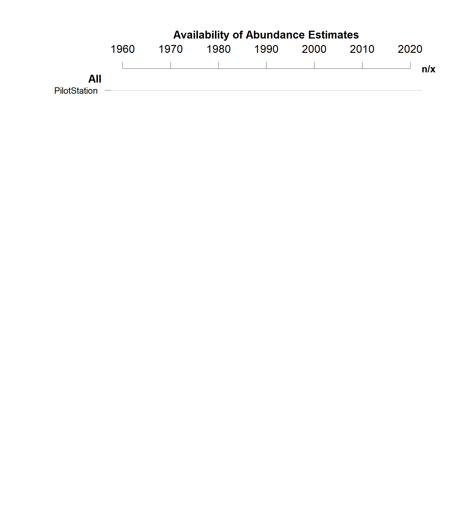

```{r setup, include=FALSE}
knitr::opts_chunk$set(echo = TRUE)


# read in the data files to be used

library(tidyverse)

proj.info.df <-  read.csv("data/Profiles/ProjectInfo_Lookup.csv",stringsAsFactors = FALSE)

main.data.df <-  read.csv("data/DerivedData/ProjectData_MainFile.csv", stringsAsFactors = FALSE)
summary.df <-  read.csv("data/DerivedData/ProjectData_Summary.csv", stringsAsFactors = FALSE) %>%
                  arrange(ProjSeq)


```

## Overview

This is a very basic illustration of the kind of automated reports you can generate with R markdown. In this set-up, you have limited options for formatting (e.g., page breaks or figure captions require workarounds), but it shows the key benefit: every time you source data is updated you can quickly generate an updated report with all the  updated figures and tables. 

This document was generated following the steps from this [worked example](https://rmarkdown.rstudio.com/articles_docx.html). For an in-depth description of many possibilities for markdown reports (pdf, html, word, powerpoint), start with [this guide](https://epirhandbook.com/en/reports-with-r-markdown.html). For a properly formatted technical report, consider the versatile [bookdown package](https://bookdown.org/yihui/rmarkdown/) or the  [csasdown extension ](https://github.com/pbs-assess/csasdown) specifically for DFO technical reports and research documents.

*Important*: It is easy to get lost in the beautiful intricacies of generating perfectly-formatted reports using these more powerful tools for generating reports from markdown. However, the real bottleneck is getting a streamlined workflow up and running, from the individual data contributors to a basic summary of available information. Until that step works smoothly, a very basic report like this example should be sufficient. *Don't procrastinate on the hard part by spending your time on the flashy stuff!*


## Example of Automated Summary Text

*The values in the text below are calculated from the data summaries and update automatically when the source data changes*


The current data set covers `r length(unique(summary.df$Project))` assessment projects. Survey types include `r paste(sort(unique(summary.df$SurveyType)),collapse = ", ")`. The earliest record is from `r min(summary.df$FirstYr)`.


## Example of A Summary Plot




**Figure 1:** Overview of available data. For each assessment project, the timeline shows available estimates, categorized into three types: records for which uncertainty has been quantified (i.e., a coefficient of variation, CV, is available as well), records for which only a point estimate is available, and records that have been excluded due to data quality concerns (e.g., poor visibility during aerial survey).


## Another Example of A Summary Plot


**Figure 2:** Comparison of abundance estimates across project. Figure shows the smallest, mean, and largest abundance estimate. Projects are ranked by mean estimate. 


## Example of a Summary Table

**Table 1:** Project inventory.

``` {r message=FALSE,echo=FALSE}
library(knitr)
table.df <- summary.df %>% select(Stock,Watershed,SurveyType, NumEst, NumCV, FirstYr, LastYr)

kable(table.df)


```

## Example of A Project Detail Section


